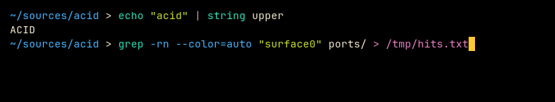
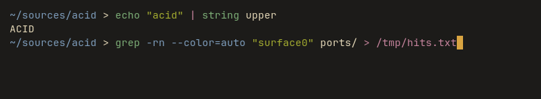

# Acid for fish

Two flavours: **Acetic** (`#000000`), vibrant, and **Citric** (`#1c1b19`), muted.

Part of [Acid](https://github.com/acid-theme/acid), a very dark colourscheme in two
flavours. The main README lists the other ports.

## Preview

| Acetic | Citric |
| --- | --- |
|  |  |

## Install

With fisher:

```fish
fisher install acid-theme/fish
fish_config theme choose "Acid Acetic"
```

`fish_config` writes universal variables, which usually are not committed with a
config. To keep the theme in tracked config instead, use the `conf.d` form,
which sets the same variables globally:

```fish
curl -fsSLo ~/.config/fish/conf.d/acid-acetic.fish \
  https://raw.githubusercontent.com/acid-theme/fish/main/conf.d/acid-acetic.fish
```

Use one or the other, not both.

## Files

- `themes/Acid Acetic.theme`
- `themes/Acid Citric.theme`
- `conf.d/acid-acetic.fish`
- `conf.d/acid-citric.fish`

## Generated

Acid 0.1.0, rendered by acidify from
[`ports/fish/acid.fish.tera`](https://github.com/acid-theme/acid/blob/main/ports/fish/acid.fish.tera).
Edits to these files are overwritten on the next release. Report issues on
[acid-theme/acid](https://github.com/acid-theme/acid/issues).

## Licence

MIT.
