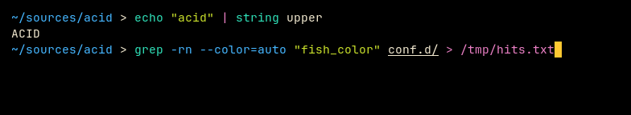
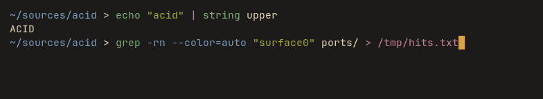
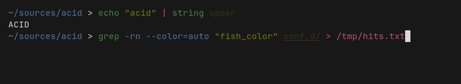

# Acid for fish

Generated from [acid-theme/acid](https://github.com/acid-theme/acid) — open issues
and pull requests there.

<details>
<summary>Screenshots</summary>

| Acetic | Citric | Lactic |
| --- | --- | --- |
|  |  |  |

</details>

## Install

With fisher:

```fish
fisher install acid-theme/fish
fish_config theme choose "Acid Acetic"
```

`fish_config` writes universal variables, which usually are not committed with a
config. To keep the theme in tracked config instead, use the `conf.d` form,
which sets the same variables globally:

```fish
curl -fsSLo ~/.config/fish/conf.d/acid-acetic.fish \
  https://raw.githubusercontent.com/acid-theme/fish/main/conf.d/acid-acetic.fish
```

Use one or the other, not both.

## Credits

[@ssiyad](https://github.com/ssiyad)
